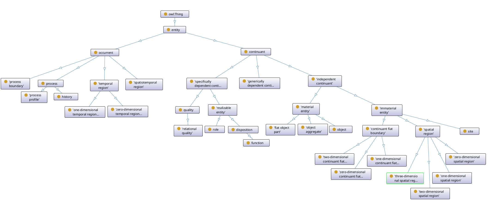
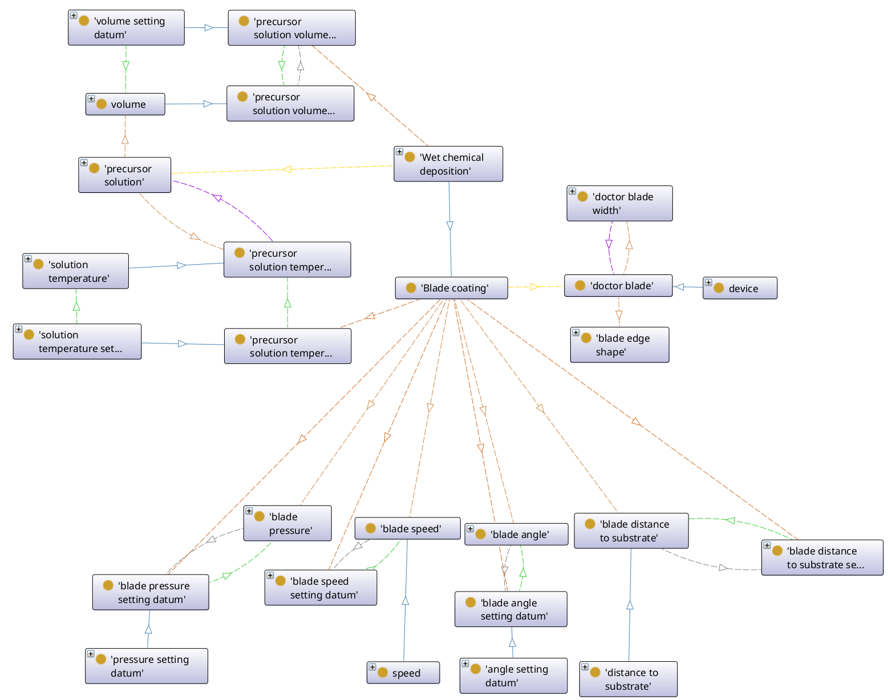
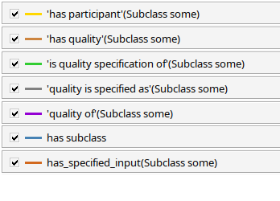

This Document was created to give you a quick rundown on the Ontology for thin-film solar cells.

# Ontology for thin-film solar cells (TFSCO)

## Domain

The Ontology for thin-film solar cells (TFSCO) was created to improve the data quality within the Thin-film solar cell domain. It includes measurement and characterization processes, their parameters and relations between the participating entities.

## Additional Information

Before we jump right into the content of the TFSCO here are some Informations about the TFSCO:
1. To browse the ontology visit the current repository of the TFSCO: [https://purl.archive.org/tfsco](https://purl.archive.org/tfsco).
2. You can find the latest version of the TFSCO at [https://purl.archive.org/tfsco/latest](https://purl.archive.org/tfsco/latest) 
3. You can create an issue or contribute via [https://purl.archive.org/tfsco/issues](https://purl.archive.org/tfsco/issues)  
4. It has been created in August of 2022 at Helmholtz-Zentrum Berlin.  
5. It is licensed under the CC BY 4.0.

## Basic Structure

The TFSCO uses the Basic Formal Ontology ([BFO](https://www.ebi.ac.uk/ols4/ontologies/bfo)) as its Top-Level-Ontology. Top-Level-Ontologies provide a framework, that "helps integrate and organize information across different domains"¹. It provides a basic structure for the ontology by dividing everything in continuants (things that persist through time) and occurents (things that happen or occure like events or processes). Therefore most of our measurements and characterizations are occurents while solar cells or measurement outputs are continuants.

||
|:--:| 
|*The BFO classes*|

## Classes and Relations

Central pieces of an ontology are the Classes and Relations. Classes describe all entities (continuants and occurents) while relations describe the connection between entities (e.g. the relation between a solar cell and its different layers).

### Classes

### Relations

While the 'is_a' relation is a key-relation within thesauri and ontologies by providing a hierarchical (vertical) structure we need further relations to describe the horizontal connections/interactions/ (e.g. the relation between a measurement and its input, which might include equipment settings and the device that is being measured)

## Datums
Within the TFSCO all Datums are Data Items. We further distinguish between Datums, Scalar Datums, Setting Datums and Measurement Datums.

### Scalar Datums

Scalar Datums are datums, that consist of two parts. A numerical part and a unit part (e.g. 50nm, 15ml, 15°)

### Measurement Datums

Measurement Datums are datums, that are the result of a measurement process. (e.g. the measurd temperature of a hotplate)

### Setting Datums

Setting Datums are datums, that specify the setting of a given machine. (e.g. turning the heater knob to 180°C)

## IRI (International Ressource Identifier) & PURL (Persistent Uniform Ressource Locator)
The TFSCO's PURL [https://purl.archive.org/tfsco](https://purl.archive.org/tfsco) is a permanent link, that leads to the repository in which the TFSCO is currently stored. 
Every Class and Relation within the TFSCO has an unique identifier.   For Classes, that have been created as part of the TFSCO, the IRI for Blade Caoting looks like this: *https://purl.archive.org/tfsco/TFSCO_00002060*.
It consists of the PURL *https://purl.archive.org/tfsco* and an unique 8-digit number that identifies the entity within the TFSCO.

## Example of Usage

### Blade Coating

Blade Coating is a deposition process, that deposits a new layer/phase onto some substrate by adding a precursor solution and removing excess ink by blade from a substrate.
In the middle of the picture you can see the *Blade Coating*-Class.   Below it, we can see the *Blade Coating*-Qualities (e.g. Blade Angle, Precursor Volume) and their accompanying *Setting Datums*.   To the right of the *Blade Coating*-Class we can see the *Doctor Blade*-Class. It is a participant in the Blade Coating Process and its Qualities are the Edge-Shape and Width. On the right side of the Blade Coating you can find the *Precursor Solution* and its Qualities.
  Blue arrows indicate the *is_a* Relation (e.g. *Blade Coating* is_a *Wet Chemical Deposition*)

The following blade coating-parameters are present in the TFSCO:  

- The Blade Angle
- The Blade Pressure
- The Blade Speed
- The Blade Width
- The Distance between the blade and the Substrate
- The Process Time/Duration
- The Shape of the Blades Edge
- The Substrate Temperature
- The Temperature of the Precursor Solution
- The Volume of the deposited precursor Solution

||
|:--:| 
|*Blade Coating Classes*|
||
|*Relation Explanation*|

Sources:
¹ Barry Smith Building Ontologies with Basic Formal Ontology